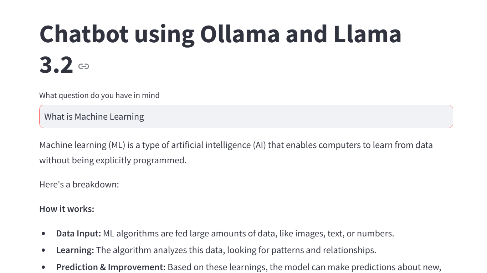
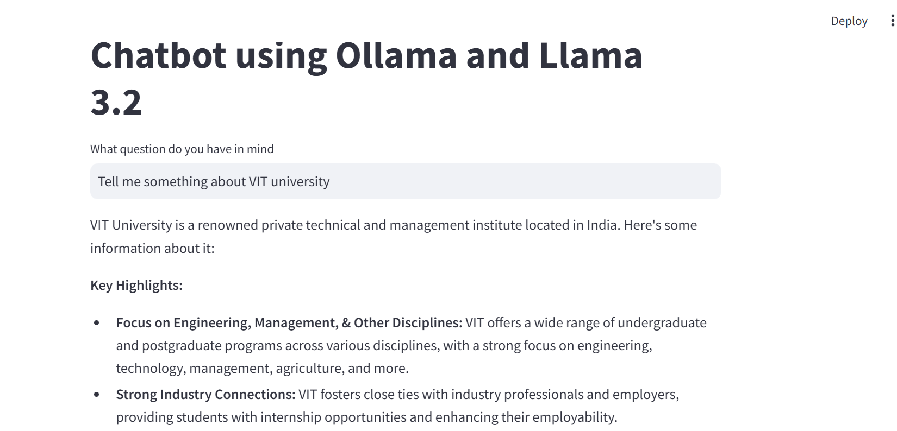
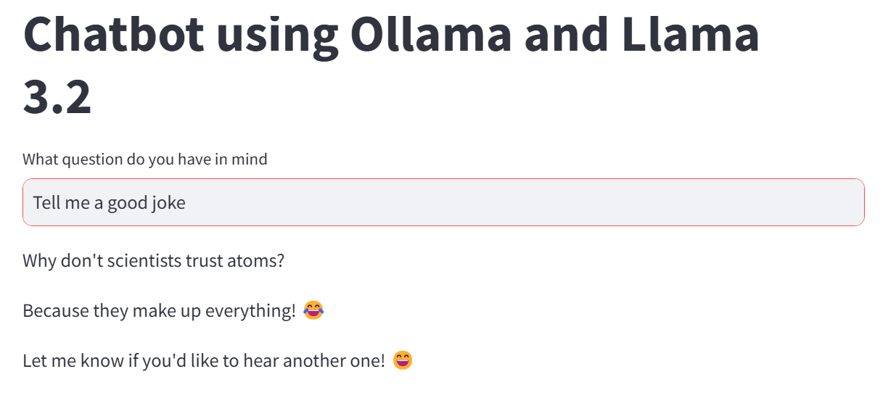
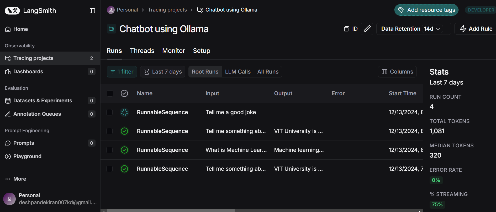
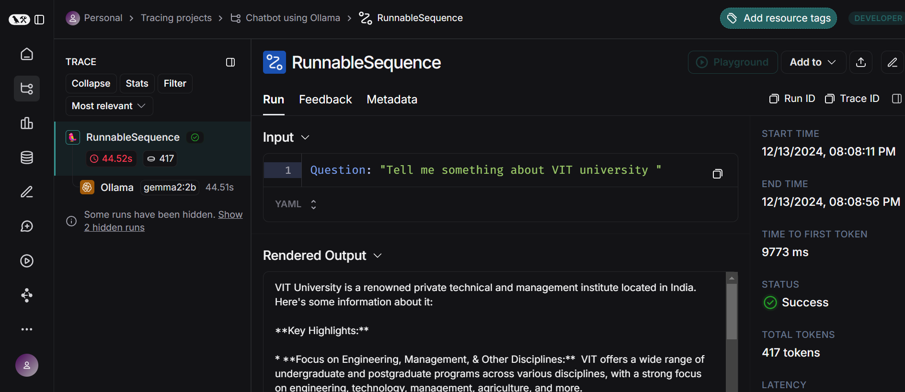

# Chatbot using Ollama and Gemma

## Project Overview
This project demonstrates the development of a chatbot application leveraging state-of-the-art AI technologies. The chatbot uses the "Gemma2" language model, hosted on Ollama, to provide accurate and efficient conversational responses. By integrating LangChain for workflow management and Streamlit for a user-friendly interface, the project highlights how modern tools can simplify the deployment of AI-powered solutions.

## Project Structure

```
├── app.py               # Main application file
├── requirements.txt     # Dependencies for the project
├── .env                 # Environment variables (not included in the repository)
```

## Installation
### Prerequisites
1. Firstly download Ollama from [here](https://ollama.ai/download) and install it in your system and open the `cmd` or `terminal` and run the following command:
    ```
    ollama run gemma2:2b
    ```

### Steps

1. Clone the repository:

   ```cmd
   git clone https://github.com/kiran-91/Simple-Chatbot-Using-Ollama-Gemma2.git
   cd Simple-Chatbot-Using-Ollama-Gemma2
   ```

2. Create a virtual environment (optional but recommended)

    ```cmd
    python -m venv venv
    source venv/bin/activate  # For Linux/MacOS
    venv\Scripts\activate  # For Windows
    ```

3. Install the required Python packages:

   ```cmd
   pip install -r requirements.txt
   ```

4. Create a `.env` file to securely store your API keys:

   ```env
   LANGCHAIN_API_KEY=<your_langchain_api_key>
   LANGCHAIN_PROJECT=<your_langchain_project_name>
   LANGCHAIN_TRACING_V2=true

   ```

5. Run the Streamlit application:

   ```cmd
   streamlit run app.py
   ```


## App Usage

1. Enter your question in the text input field.
2. View the chatbot's response generated using the "gemma2" language model.
3. If any errors occur, they will be displayed in the Streamlit interface.

- **Check out these images**





- **The following images demonstrate the tracking of LLM model query responses on the Langsmith platform, providing detailed insights and metadata**




## About Ollama, LangChain, and Gemma2

- Ollama: A cutting-edge platform for large language model (LLM) hosting and deployment. It provides a seamless API to integrate powerful models into your applications.

- LangChain: A versatile framework for building applications powered by LLMs. It simplifies prompt engineering, model integration, and workflow management.

- Gemma2: A specific language model available through Ollama developed by Google, designed to deliver high-quality conversational responses with a focus on speed and efficiency. The "2b" variant represents a balance between model size and performance.

## Acknowledgments

- [LangChain](https://www.langchain.com/)
- [Streamlit](https://streamlit.io/)
- [Ollama](https://ollama.com/)
- [Gemma2:2b](https://aistudio.google.com/app/prompts/new_chat?model=gemma-2-2b-it)

